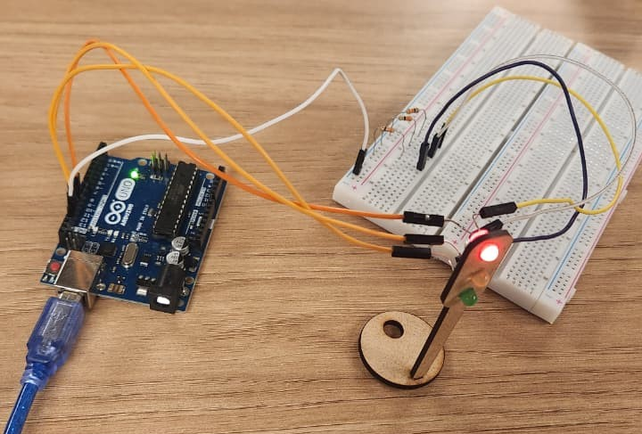

## Montagem
Foram utilizados cabos jumper e a protoboard para conectar a porta GND do arduino uno a cada uma das pernas negativas dos leds. 

Para o positivo, conecta-se a porta 11, 12, 13 do arduino as pernas positivas dos leds, passando por um resistor de 330 Ω. 

  

## Componentes Utilizados

| Item | Descrição   | Especificação   | Quantidade |
|------|-------------|-----------------|------------|
| 1    | LED         | 5 mm, 1.8–2.2 V | 3          |
| 2    | Resistor    | 330 Ω           | 3          |
| 3    | Arduino Uno | 16 MHz, 32 KB   | 1          |
| 4    | Protoboard  | 2.54 mm, até 1A | 1          |
| 5    | Jumper      | 2.54 mm         | 10         |
 

## Avaliação em Pares
### Avaliador: Gabriel Willian Bartmanovicz

| Critério | Nota | Observações do Avaliador |
|----------|------|--------------------------|
| Montagem física com cores corretas, boa disposição dos fios e uso adequado de resistores | 3 | |
| Temporização adequada conforme tempos medidos com auxílio de algum instrumento externo | 3 | |
| Código implementa corretamente as fases do semáforo e estrutura do código (variáveis representativas e comentários) | 3 | |
| Ir além: Implementou um componente de extra, fez com `millis()` ao invés do `delay()` e/ou usou ponteiros no código | 3 | |

Pontuação Total: 12
  

### Avaliador: Antonio Augusto Tavares Ribeiro Andre

| Critério | Nota | Observações do Avaliador |
|----------|------|--------------------------|
| Montagem física com cores corretas, boa disposição dos fios e uso adequado de resistores | 3 | |
| Temporização adequada conforme tempos medidos com auxílio de algum instrumento externo | 3 | |
| Código implementa corretamente as fases do semáforo e estrutura do código (variáveis representativas e comentários) | 3 | |
| Ir além: Implementou um componente de extra, fez com `millis()` ao invés do `delay()` e/ou usou ponteiros no código | 3 | |

Pontuação Total: 12

## Vídeo
https://drive.google.com/file/d/1TRP6eUwosEeT0JssWQm_YlEyN5wOXojr/view?usp=sharing